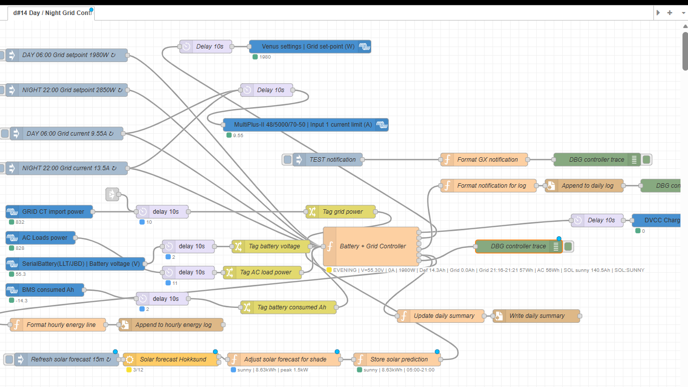
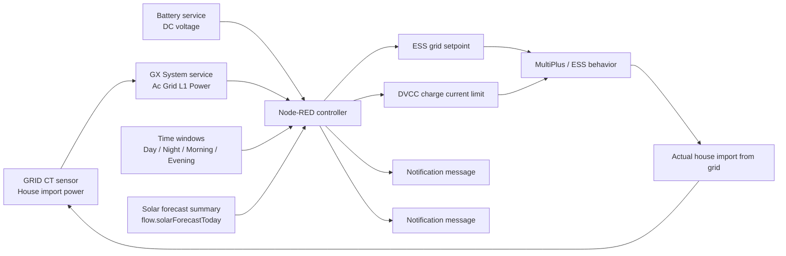
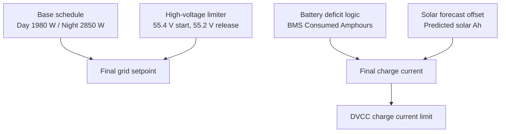
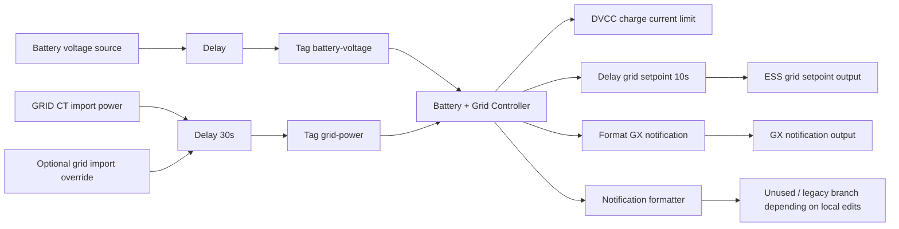

# Victron Cerbo GX hourly grid control for Norway

This repository contains a Node-RED based controller for a Victron ESS system running on Cerbo GX.

The project is designed to reduce hourly grid peaks in Norway while still allowing useful battery charging during selected time windows. The control logic combines:

- BMS consumed-Ah restoration planning for night and morning charging
- dynamic grid setpoint control
- DVCC charge current control based on remaining battery Ah deficit
- hourly imported-energy tracking from the house GRID CT sensor
- high-voltage protection when an external charger or MPPT raises battery voltage
- notification logging when the grid setpoint changes

The repository keeps a readable controller source in `day-night.txt` and a live Node-RED export in `flows.json`.

Flow versioning rule:

- the Node-RED tab label in `flows.json` uses `d#<n>` as the live flow version marker
- every change to `flows.json` must increment that marker by 1
- this makes it visible in Node-RED which exported flow revision is currently loaded

---

## Repository contents

- `day-night.txt`  
  Human-readable source-of-truth for the main Node-RED function.

- `flows.json`  
  Exported Node-RED flow used on Cerbo GX.

- `victron_elvenett_context.md`  
  Detailed design notes, tariff assumptions, and implementation history.

---

## Goal

The main operational goal is to keep hourly raw grid import under practical limits that fit Norwegian capacity-based network tariffs, while still charging the battery when needed.

The current design target is:

- daytime raw import target around `1980 W`
- night raw import target around `2850 W`
- night is allowed to be higher because this project was tuned around an Elvenett-style reduced night weighting factor

This logic is especially useful when:

- the house has a battery bank
- the inverter/charger can import from grid under ESS control
- the user wants to avoid expensive monthly capacity steps caused by a few high hourly peaks

---

## High-level architecture

### Current Node-RED flow





### Main signal flow

1. Cerbo GX exposes live data from the battery and GRID CT sensor.
2. Node-RED reads:
   - battery voltage
   - grid import power measured by the house CT sensor
   - current time
3. The controller calculates:
  - how many Ah the battery still needs to restore from the BMS net consumed-Ah reading
  - whether the remaining deficit must be charged now in NIGHT, or can wait for MORNING
  - how much predicted solar energy can offset that remaining grid-charging need
   - the final grid setpoint
   - the hourly imported energy used so far
4. The outputs are written back into Victron settings and VE.Bus controls.
5. Actual import changes and the loop repeats.

---

## Control layers

The controller is not a single rule. It is a stack of limits.



### Priority order

The final grid setpoint is the minimum of:

1. base schedule
2. high-voltage limiter

Hourly imported energy is still tracked and shown in status text, but it is display-only and does not override the schedule.

---

## Functional behavior

## 1. Charging windows

The battery charging logic now uses the BMS `Consumed Amphours` value as the net deficit that needs to be restored toward zero.

### Night window

- active time: `22:00-05:59`
- charge current is `25 A` only when the remaining deficit is too large to be fully restored during the remaining MORNING window
- if the remaining MORNING window alone can still restore the deficit, night charging stays off

### Morning window

- active time: `06:00-11:59`
- charge current is `25 A` whenever any grid-restoration deficit still remains after subtracting predicted solar contribution

### Evening window

- active time: `17:00-23:59` with night taking priority from `22:00`
- no grid-restoration charging is scheduled in this window

### Outside windows

- charge current limit goes to `0 A`
- grid control still remains active

---

## 2. Grid setpoint schedule

Base target:

- day: `1980 W`
- night: `2850 W`

This is only the starting point. The controller may lower it further if:

- the battery voltage is already too high

---

## 3. High-voltage protection

This layer exists because an external charger or MPPT may increase battery voltage even when the Victron charger is not the only charging source.

Behavior:

- limiter starts when battery voltage rises above `55.4 V`
- limiter remains active until battery voltage falls back to `55.2 V` or below
- the grid setpoint tapers down smoothly
- by `55.6 V`, the voltage limiter can push the setpoint down toward `200 W`

Smoothing is used so the grid setpoint does not jump too aggressively.

---

## 4. Solar forecast effect

The controller reads `flow.solarForecastToday` and uses the predicted energy amount to reduce the grid Ah that must be restored overnight and in the morning.

Behavior:

- forecast is accepted only when it is for the current day and not older than `18` hours
- forecast energy is converted to estimated battery Ah using battery voltage and a fixed efficiency factor
- that estimated solar Ah is subtracted from the BMS consumed-Ah deficit
- grid setpoint is not changed by the forecast

Current conversion constants:

- nominal battery voltage fallback: `52 V`
- solar-to-battery efficiency factor: `0.9`

Practical correlation with charging:

- the BMS provides the net consumed capacity in Ah
- predicted solar energy is converted to an estimated restoration amount in Ah
- the remaining grid-restoration target is:

$$
	ext{gridRestoreAhNeeded} = \max(0, \text{consumedAhDeficit} - \text{forecastRestoreAh})
$$

- if NIGHT is active, charging starts only when the remaining MORNING capacity at `25 A` is no longer enough to cover `gridRestoreAhNeeded`
- if MORNING is active, charging runs at `25 A` while `gridRestoreAhNeeded` is still above a small deadband
- high-voltage tapering can still reduce the final charge current below `25 A` when the grid setpoint is being limited

---

## 5. Hourly consumed-energy counter

The controller keeps an hourly counter of imported energy in `Wh`.

Important details:

- source = `GX System -> /Ac/Grid/L1/Power`
- this is the GRID CT sensor that measures house import power
- only positive import is accumulated
- the counter resets every new clock hour
- the status text shows:
  - the exact start time when accumulation began in the current hour
  - the end of the current hour
  - accumulated `Wh`

Example status:

- `13:07-14:00 606Wh`

Meaning:

- import accumulation began at `13:07`
- the current hour ends at `14:00`
- `606 Wh` has been counted so far in that hour window

If tracking started exactly at the top of the hour, the status also shows the remaining average watts left in the hour. This is informational only and does not change any outputs.

---

## 6. Notifications and outputs

The main controller returns five outputs:

- DVCC charge current limit
- ESS grid setpoint
- a placeholder third output where `ac-input-current-limit` is emitted as `null`
- a notification/log message when the grid setpoint changes
- an hourly energy rollover message used by the energy log and daily summary writers

The live flow still contains separate inject nodes for manual or scheduled current values, but the main controller no longer manages VE.Bus Input 1 current limit dynamically.

The live flow now also reads the battery service path `com.victronenergy.battery/4 -> /ConsumedAmphours` and tags it as `battery-consumed-ah` for the controller.

---

## 7. Output update pacing

To avoid excessive control chatter, the live flow adds output delays:

- charge current limit changes are rate-limited to every `10 seconds`
- grid setpoint changes are rate-limited to every `10 seconds`

This prevents rewriting Victron settings every second.

---

## Node-RED architecture



### Notes

- `day-night.txt` should remain the readable master logic.
- `flows.json` should be synchronized after each controller update.
- Notification transport exists in the flow, but the local GX notification output may depend on service availability on the target Cerbo GX.

---

## Pricing model in Norway

This section explains the pricing model relevant to why this controller exists.

Exact tariffs vary by:

- network company
- electricity supplier
- municipality
- taxes and government changes over time

This README therefore focuses on the structure of Norwegian pricing and on the project assumptions used in the controller.

## 1. Typical electricity bill structure in Norway

A Norwegian electricity bill usually has two major commercial parts:

### A. Power supplier cost

This is what you pay the electricity supplier for the energy itself.

Typical components:

- Nord Pool spot price by hour
- supplier markup
- fixed monthly fee, if applicable
- VAT, where applicable

This part is energy-based, so it depends on `kWh` consumed in each hour.

### B. Network tariff (`nettleie`)

This is what you pay the local grid company.

Typical components:

- energy charge (`øre/kWh`)
- capacity charge (`kapasitetsledd`)
- public fees and taxes
- fixed elements, depending on tariff design

For many households, the network tariff is strongly affected by the highest hourly peaks during the month.

---

## 2. Why hourly power matters

In Norway, the network tariff for households increasingly depends on hourly peak behavior.

That means:

- a short period of high power can be more expensive than the same energy spread over time
- the bill is influenced not only by total `kWh`, but also by the shape of consumption
- battery charging is a common cause of artificial hourly peaks

This repository therefore aims to flatten imported power by controlling charging intensity.

---

## 3. Project assumption: Elvenett-style capacity logic

This project was tuned around an Elvenett interpretation discussed during development:

- daytime practical raw target around `1.98 kW`
- night hours may be weighted lower for capacity purposes
- the user specifically optimized around a night factor of `0.7`

That implies the following reasoning:

- daytime raw `1.98 kW` stays close to the desired practical cap
- night raw import can be somewhat higher without causing the same effective capacity burden
- a practical night target of about `2.85 kW` is acceptable for this system design

Example project math:

- `2.85 kW raw * 0.7 = 1.995 kW effective`

This is why the repository uses:

- day base setpoint: `1980 W`
- night base setpoint: `2850 W`

---

## 4. Capacity-step risk

A key operational idea is that the bill is often driven by a few bad hours, not by average behavior.

Risk pattern:

- battery charging starts too hard
- total house load is already elevated
- the hour ends with a high raw import peak
- the month is pushed into a higher capacity step

The controller reduces that risk by:

- lowering charging when the battery is already sufficiently charged
- displaying how much import has already been used earlier in the same hour
- allowing more relaxed behavior at night

---

## 5. Hourly visibility model used by this controller

The controller keeps an hourly energy visibility approximation for status and tuning.

For each clock hour:

- `E_budget_Wh = target_power_W * 1h`
- `E_used_Wh` is accumulated from live GRID CT power
- `E_left_Wh = max(0, E_budget_Wh - E_used_Wh)`
- allowed average power for the rest of the hour is recalculated from the remaining time

Conceptually:

```text
E_budget_Wh = P_limit * 1h
E_left_Wh   = max(0, E_budget_Wh - E_used_Wh)
P_allow_W   = E_left_Wh / t_left_h
```

This is currently shown for operator awareness only. It does not directly tighten the controller outputs.

---

## 6. Practical Norwegian interpretation

This project should be understood as a control strategy for Norwegian household electricity economics, not just a charging script.

It tries to optimize three things at once:

1. maintain usable battery state-of-charge
2. avoid unnecessary raw hourly peaks during the day
3. exploit more favorable night conditions when available

In practice, that means the system behaves like a soft peak-shaving battery charger.

---

## Operational assumptions

This repository assumes:

- Cerbo GX with Venus OS Large
- Node-RED installed on the GX device
- Victron ESS capable system
- battery service visible on D-Bus / Victron nodes
- GRID CT sensor visible via `com.victronenergy.system /Ac/Grid/L1/Power`
- one-phase import measurement for the tuned logic in this repo

If the installation is three-phase, the grid measurement source and budget logic should be adapted accordingly.

---

## Deployment workflow

Recommended workflow when editing the logic:

1. edit `day-night.txt`
2. synchronize the function content into `flows.json`
3. increment the `d#<n>` tab version in `flows.json`
4. import or deploy the updated flow to the Cerbo GX
5. verify:
   - battery voltage input is updating
   - GRID CT import power is updating
   - status text shows correct hour range and `Wh`
  - charge current limit and grid setpoint change no faster than every 10 seconds

---

## Current limitations

- the hourly counter currently uses `L1` grid power; multi-phase sites need adaptation
- the project is tuned to one specific tariff interpretation and should be validated against the actual current network tariff
- local GX notification injection may not work on all installed Victron node versions
- actual charging behavior still depends on ESS mode and total system state; a DVCC limit is not itself a direct “force charge” command
- `flows.json` may still contain legacy inject nodes or unused branches that are no longer driven by the main controller

---

## Recommended future improvements

Future tasks to improve the model:

- [ ] use **remaining forecast energy from now forward** instead of subtracting the full-day solar forecast from the current battery deficit
- [ ] split the BMS `Consumed Amphours` deficit across **remaining NIGHT hours and remaining MORNING hours** instead of treating MORNING as the only fallback window
- [ ] replace the current on/off `25 A` restoration with a **required average charge current** calculation, capped at `25 A`
- [ ] smooth the BMS `Consumed Amphours` signal with a short moving average or deadband so short-term noise does not cause bursty morning charging
- [ ] calibrate the Ah-restoration math using real battery data:
  - verify whether `/ConsumedAmphours` sign handling is always negative-for-deficit on this BMS
  - tune `SOLAR_TO_BATTERY_EFFICIENCY`
  - tune the fallback battery voltage used for kWh-to-Ah conversion
- [ ] use **live battery power/current** together with `Consumed Amphours` to estimate how quickly restoration is actually happening instead of assuming the commanded DVCC current becomes stored battery capacity directly
- [ ] add a small **target reserve** so the controller does not always try to restore exactly to zero deficit when forecast uncertainty is high
- [ ] distinguish between `sunny`, `cloudy`, and `low` forecast days using **remaining hourly forecast profile** instead of only the current whole-day summary
- [ ] add logging for:
  - starting consumed-Ah deficit at 22:00 and 06:00
  - forecast Ah offset used by the controller
  - actual Ah restored by end of MORNING window
  - whether the restoration target was met
- [ ] add a daily review report comparing:
  - predicted solar restoration Ah
  - actual solar/battery restoration Ah
  - grid energy imported for restoration
  - final remaining deficit at noon
- [ ] support 3-phase grid measurement for sites where `L1` is not enough
- [ ] move tariff constants, battery constants, and restoration tuning parameters into a dedicated config object or file
- [ ] add explicit handling for spot-price based charging optimization on top of the Ah-restoration model

---

## Summary

This repository is a practical Victron + Node-RED implementation for Norwegian hourly peak control.

It combines:

- time-window charging
- solar-forecast-aware current reduction
- voltage hysteresis
- hourly imported-energy counting
- dynamic power limiting
- Norway-oriented tariff thinking

The result is a controller that is intended to be understandable, editable, and directly useful on a Cerbo GX based ESS installation.
